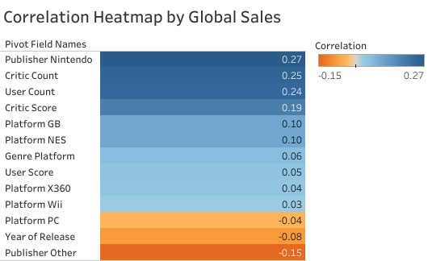
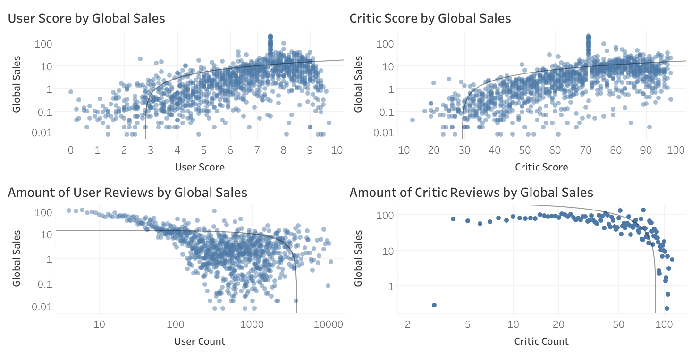
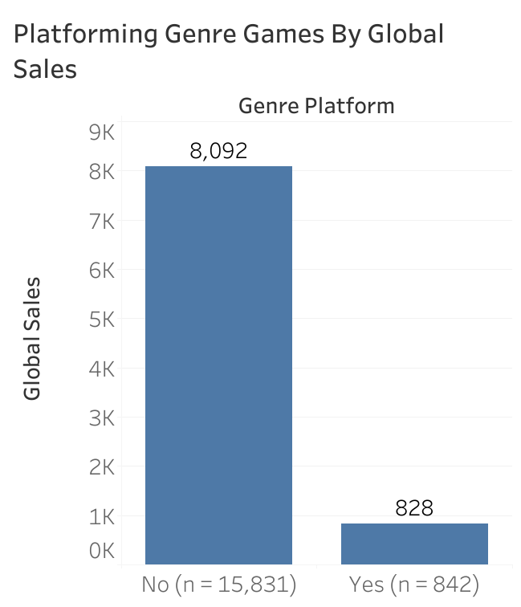
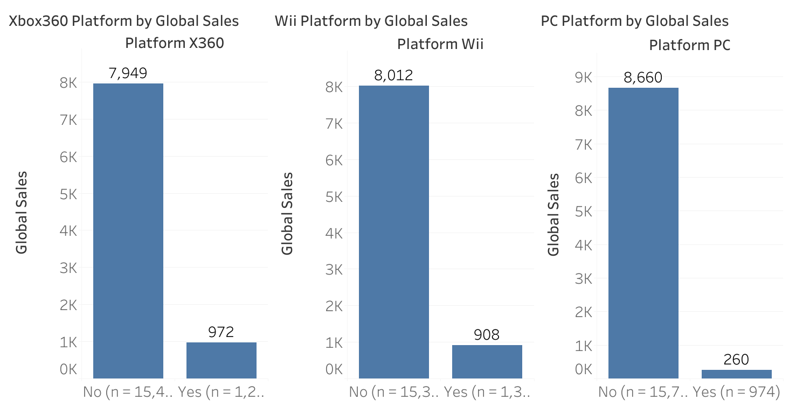
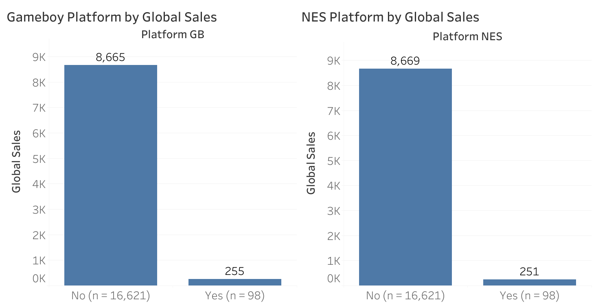
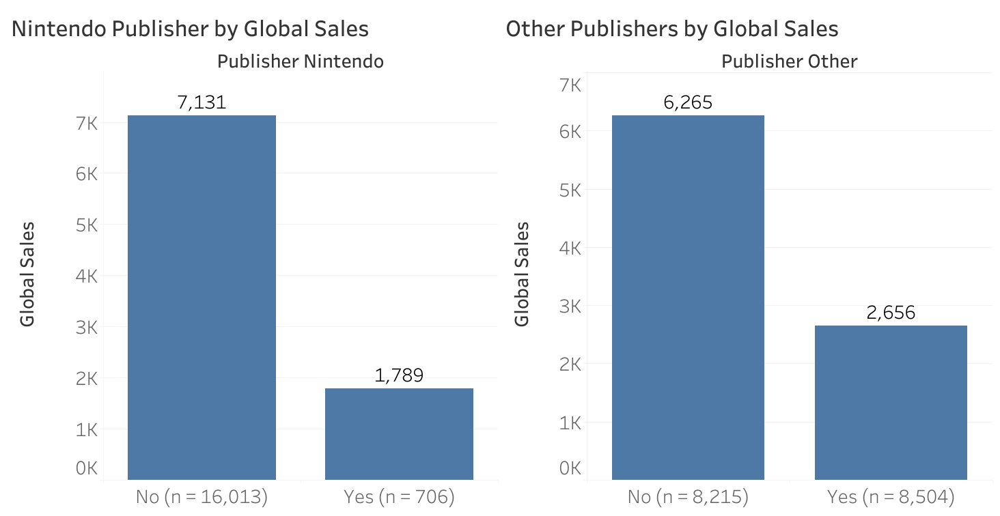

# Video Game Sales Analysis

## Overview

This project analyzes historical video game sales and review data to identify industry trends, regional preferences, platform performance, and publisher success.

Using Python and Tableau, the analysis explores how factors such as genre, platform, critic ratings, and geographic region influenced global video game sales.

The goal of the project is to generate business insights that could support data-driven decision-making for game publishers and developers.

---

## Business Problem
Video game publishers and developers need to understand:
- Which genres perform best globally
- Regional gaming preferences
- Top-selling platforms
- Publisher market performance
- Sales trends over time

This analysis aims to uncover patterns in video game sales that can support marketing, development, and publishing strategies.

---

## Dataset
Source: [Video Game Sales with Ratings Dataset (Kaggle)](https://www.kaggle.com/datasets/rush4ratio/video-game-sales-with-ratings/data)

The dataset includes:
- Game Title
- Platform
- Release Year
- Genre
- Publisher
- Regional Sales (NA, EU, JP, Other, Global)
- Critic Score
- User Score
- Developer
- ESRB Rating

---

## Tools Used
- Python
- Pandas
- NumPy
- Scikit-learn
- Tableau

---

## Data Cleaning & Preparation
The following preprocessing steps were completed:

- Handled missing values using median imputation
- Converted `User_Score` to numeric format
- Applied one-hot encoding to categorical variables
- Grouped low-frequency publishers into an `"Other"` category (Publishers outside of the top 10 are set to 'Other')
- Removed redundant and non-predictive features
- Standardized numerical variables using `StandardScaler`
- Selected significant predictors using feature selection techniques

---

## Machine Learning

A stacking ensemble regression model was developed to predict global video game sales.

### Models Used

- ElasticNet
- Support Vector Regression (SVR)
- Decision Tree Regressor
- AdaBoost Regressor
- Random Forest Regressor
- Extra Trees Regressor

### Evaluation Metrics

- RMSE (Root Mean Squared Error)
- R² Score
- K-Fold Cross Validation

---

## Exploratory Data Analysis

The analysis focused on:

- Global sales trends
- Top performing video game genres
- Platform popularity
- Correlation between global sales and different data points

---

## Key Insights

- The publisher Nintendo has the largest positive impact on global sales
- Higher critic and user review scores were generally associated with stronger global sales performance
- Classic Nintendo consoles contain a small amount of games within the dataset but carry a large amount of sales
- Platform games consistently outperform other genres in global sales, suggesting stronger mainstream appeal and franchise longevity

---

## Heatmap


---
> The heatmap above highlights different variables and how heavily they contribute to global sales in either a negative or positive way.
> While the heatmap shows individual correlations between variables and sales, it does not capture interaction effects where combinations of features (e.g., platform + genre) have a stronger impact.
---

## Tableau Dashboards

[](https://public.tableau.com/app/profile/kevin.pimentel7409/viz/VideoGameCriticUserDashboard/CriticUser)
---
> These visualizations highlight that video games with higher user and critic engagement and ratings translate into higher global sales.
> Games with moderate critic and user reviews are likely more mainstream releases with a broader appeal, while games with fewer reviews are likely to be niche or heavily scrutinized titles that don't necessarily translate into higher sales.
---
[](https://public.tableau.com/app/profile/kevin.pimentel7409/viz/VideoGamePlatformingGenreDashboard/PlatformGenre)
---
> Compared to all other video game geners, platforming has consistently shown powerful user engagement and interest.
---
[](https://public.tableau.com/app/profile/kevin.pimentel7409/viz/VideoGameNegativePlatformDashboard/PlatformNegative)
---
> The above consoles have a wide range when looking at the amount of titles per platform. Despite this the above consoles tend to fall short on global sales when focusing on the relative amount of video game releases.
---
[](https://public.tableau.com/app/profile/kevin.pimentel7409/viz/VideoGamePositivePlatformDashboard/PlatformPositive)
---
> In the above charts we see that despite the small amount of game titles within the Gameboy and Nintendo Entertainment System, the amount of global sales are relatively high.
---
[](https://public.tableau.com/app/profile/kevin.pimentel7409/viz/VideoGamePublisherDashboard/Publishers)
---
> With this dashboard we see that Nintendo as a video game publisher has had consistent global sales while publishers outside of the top 10 do very poorly.
> Nintendo with only 706 titles has 1,789 million copies sold while the publishers in the 'other' category have collectively had 8504 titles with only 2,656 million copies sold.
---
## Project Structure

```text
VideoGameSales/
│
├── data/
│   ├── processed/             
│   │  └── VideoGameSalesProcessedFull.csv      # Processed dataset
│   │
│   └── raw/                   
│      └── VideoGameSales.csv                   # Original raw dataset
│
├── scripts/
│   ├── VideoGameSales.py                       # Main Python script
│   ├── VideoGameSalesFF.py                     # Forward Feature script
│   ├── VideoGameSalesFI.py                     # Feature Importance script
│   └── VideoGameSalesRFE.py                    # Recursive Feature Elimination script
│
├── visualizations/
│   ├── dashboard/
│   │ ├── CriticUser.png                        # Critic and user metrics
│   │ ├── PlatformGenre.png                     # Platforming genre performance
│   │ ├── PlatformNegative.png                  # Negative correlating platforms
│   │ ├── PlatformPositive.png                  # Positive correlating platforms
│   │ └── Publishers.png                        # Publisher metrics
│   │
│   └── worksheet/
│     ├── CriticCount.png                       # Critic review count
│     ├── CriticScore.png                       # Critic review scores
│     ├── GenrePlatform.png                     # Platforming genre sales
│     ├── Heatmap.png                           # Heatmap for each metric against global sales
│     ├── PlatformGB.png                        # Nintendo Gameboy sales
│     ├── PlatformNES.png                       # Nintendo Entertainment System sales
│     ├── PlatformPC.png                        # Personal Computer sales
│     ├── PlatformWii.png                       # Nintendo Wii sales
│     ├── Platformx360.png                      # Microsoft Xbox 360 sales
│     ├── PublisherNintendo.png                 # Nintendo Publishing sales
│     ├── PublisherOther.png                    # Other Publishing Sales (Outside of the top 10)
│     ├── UserCount.png                         # User review count
│     └── UserScore.png                         # User review scores
│
├── README.md                                   # Project Documentation
│
└── requirements.txt                            # Project dependencies
```

---

## Author

Kevin Pimentel

Junior Data Analyst  
Graduate of the BCIT ADAC Program

[LinkedIn](https://linkedin.com/in/kevin-pimentel-679085405)  
[GitHub](https://github.com/KPimentel777)
